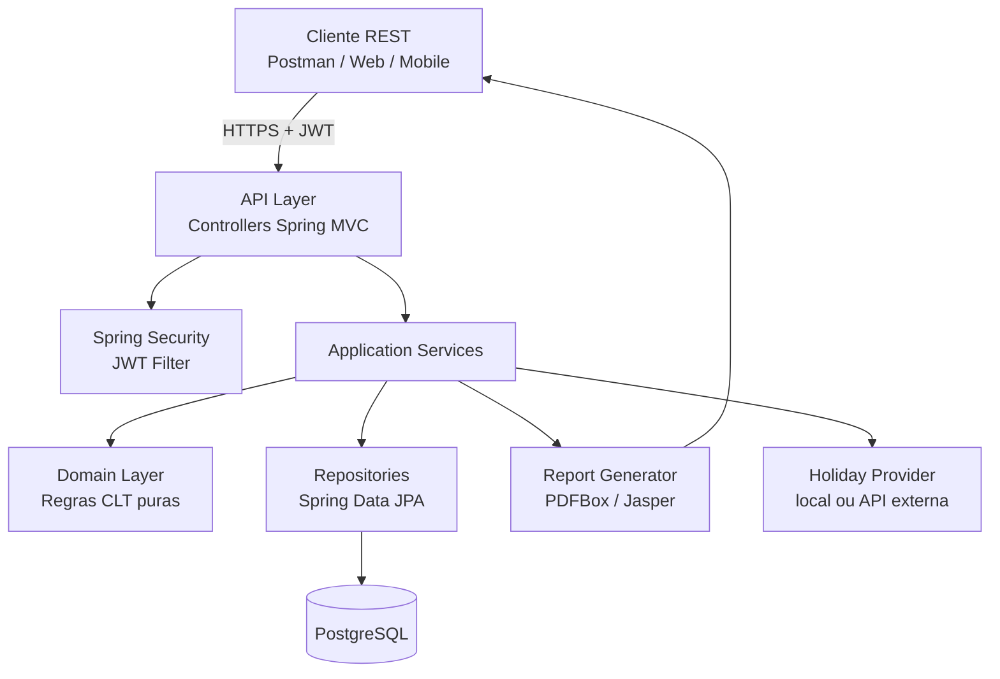
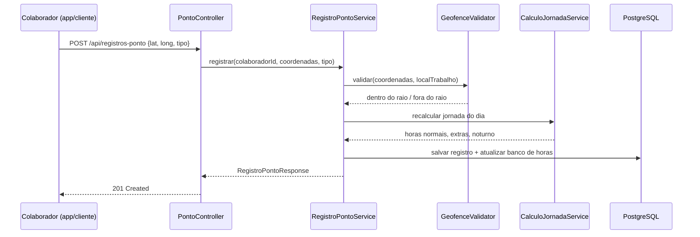
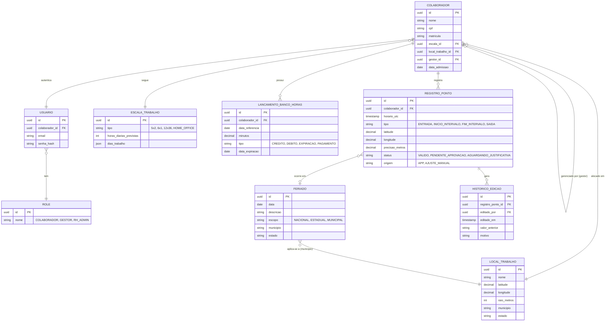

# PontoFlex — System Design

2026-09-16 · @Someone

## 1. Visão geral

**PontoFlex** é um sistema de controle de ponto eletrônico e gestão de jornada de trabalho, no estilo dos módulos de RH/Ponto de ERPs corporativos (TOTVS RM/Protheus, SAP SuccessFactors, Senior Sistemas). O sistema permite que colaboradores registrem entrada/saída via geolocalização, e que o motor de regras calcule automaticamente horas extras, banco de horas, adicional noturno e conformidade com a legislação trabalhista brasileira (CLT), gerando relatórios (espelho de ponto) exportáveis.

### Por que este projeto é forte para portfólio

Diferente de um CRUD simples, este projeto força decisões de engenharia que aparecem em entrevistas técnicas de vaga júnior/pleno:

- **Regras de negócio não triviais**: cálculo de horas extras com múltiplas faixas (50%/100%), banco de horas com expiração, adicional noturno com hora reduzida (52min30s), feriados municipais/estaduais/nacionais, escalas de trabalho (12x36, 6x1, home office).
- **Consistência de dados temporais**: fuso horário, batidas fora de ordem, batidas duplicadas, edição retroativa de ponto (com trilha de auditoria).
- **Geolocalização como restrição de negócio**: geofencing (raio permitido ao redor do local de trabalho), validação de coordenadas e tolerância de precisão do GPS.
- **Domínio que você já entende**: você trabalha com TOTVS (ERP) e Protheus/ADVPL no módulo de Manufatura — falar sobre esse domínio em entrevista com propriedade é uma vantagem real, mesmo migrando de stack.
- Conecta diretamente com seu objetivo de trabalhar em empresas grandes/ERP (inclusive na Europa) — dá para explicar em inglês que você modelou um domínio equivalente ao que é usado por HRIS internacionais (Workday, SAP SuccessFactors), adaptando regras locais como exemplo de flexibilização de motor de regras por país/região.

### Escopo do MVP vs. estendido

**MVP (essencial para o portfólio funcionar e impressionar):**

1. Cadastro de colaborador, escala de trabalho e local de trabalho autorizado (geofence)
2. Registro de ponto (bater ponto) com validação de geolocalização
3. Cálculo de horas trabalhadas, horas extras e adicional noturno por dia
4. Banco de horas (saldo acumulado, positivo/negativo)
5. Relatório mensal (espelho de ponto) exportável em PDF/CSV
6. Autenticação e autorização (colaborador vs. gestor/RH)

**Estendido (para depois, se quiser aprofundar):**

1. Aprovação de ajuste manual de ponto por gestor (workflow de aprovação)
2. Feriados customizados por município via integração com API externa de feriados
3. Notificações (e-mail) de pendências e inconsistências
4. Dashboard analítico (absenteísmo, horas extras por equipe)
5. Multi-tenant (mais de uma empresa usando o mesmo sistema)

### Stack escolhida

| Camada | Tecnologia | Motivo |
| --- | --- | --- |
| Backend | Java 25 + Spring Boot 3.x | Spring Web, Spring Data JPA, Spring Security, Bean Validation |
| Banco de dados | PostgreSQL | Bom suporte a tipos de data/hora; extensível com PostGIS para geofencing avançado |
| Migração de schema | Flyway | Versionamento de schema auditável |
| Testes | JUnit 5, Mockito, Testcontainers | Testes de integração com Postgres real em container |
| Documentação de API | springdoc-openapi | Swagger UI gerado automaticamente |
| Build | Maven | Padrão de mercado, bem suportado pelo Claude Code |
| Containerização | Docker + docker-compose | App + banco sobem juntos localmente |
| CI | GitHub Actions | Build, testes e lint a cada push |
| Relatórios | Apache PDFBox ou JasperReports | Geração do espelho de ponto em PDF |

## 2. Requisitos

### Requisitos funcionais

| # | Requisito |
| --- | --- |
| RF01 | Colaborador registra ponto (entrada, início/fim de intervalo, saída) informando lat/long do dispositivo |
| RF02 | Sistema valida se a batida ocorreu dentro do raio de geofence do local de trabalho vinculado ao colaborador |
| RF03 | Sistema calcula automaticamente horas trabalhadas, horas extras (50%/100%) e adicional noturno por dia |
| RF04 | Sistema mantém saldo de banco de horas por colaborador, com regras de expiração (ex.: 6 meses) |
| RF05 | Gestor/RH pode consultar e ajustar manualmente uma batida, com justificativa obrigatória e trilha de auditoria |
| RF06 | Sistema calcula feriados (nacionais/estaduais/municipais) e aplica regra de dia não útil no cálculo |
| RF07 | Sistema suporta múltiplas escalas de trabalho por colaborador (5x2, 6x1, 12x36, home office) |
| RF08 | Sistema gera relatório mensal (espelho de ponto) em PDF e CSV, por colaborador e por período |
| RF09 | Autenticação via JWT, com papéis distintos: COLABORADOR, GESTOR, RH/ADMIN |
| RF10 | Colaborador só visualiza os próprios registros; gestor visualiza os registros da sua equipe; RH visualiza tudo |

### Requisitos não funcionais

| # | Requisito |
| --- | --- |
| RNF01 | **Precisão temporal**: todos os timestamps armazenados em UTC; conversão de fuso apenas na apresentação |
| RNF02 | **Auditabilidade**: nenhuma batida de ponto é apagada fisicamente (soft delete); toda edição gera registro histórico imutável |
| RNF03 | **Idempotência**: reenvio da mesma batida (ex.: app offline reenviando) não duplica o registro |
| RNF04 | **Segurança**: senha com hash (BCrypt), endpoints protegidos por escopo/role, validação de entrada em todos os DTOs |
| RNF05 | **Testabilidade**: regras de cálculo de jornada isoladas em classes de domínio puras, testáveis sem Spring context |
| RNF06 | **Observabilidade**: logs estruturados e endpoint de health-check (Spring Actuator) |
| RNF07 | **Portabilidade**: sobe localmente com um único `docker-compose up` |

### Fora de escopo (deixar explícito no README)

- App mobile nativo (o registro de ponto usará a API válida a partir de um cliente web/mobile simples ou Postman/Insomnia para demonstração)
- Integração real com folha de pagamento
- Reconhecimento facial/biometria (fora do escopo de portfólio, ainda que exista em produtos reais)

## 3. Regras de negócio (domínio CLT)

Esta é a parte que mais diferencia o projeto — vale isolar essas regras em classes de domínio puras (sem dependência de Spring), para conseguir testar cada regra isoladamente com JUnit.

### 3.1 Jornada e escalas de trabalho

| Escala | Descrição | Particularidade de cálculo |
| --- | --- | --- |
| 5x2 | 8h/dia, seg-sex, 2 dias de folga | Hora extra a partir da 8ª hora diária |
| 6x1 | 6 dias trabalhados, 1 de folga | Controle de descanso semanal remunerado (DSR) |
| 12x36 | 12h trabalhadas, 36h de folga | Jornada especial; horas extras calculadas diferente (excedente às 12h) |
| Home office | Jornada flexível dentro de uma janela | Geofence pode ser desabilitado ou usar raio mais amplo |

Cada colaborador tem uma **escala vigente** com data de início (e fim, quando substituída), permitindo histórico de mudança de escala sem perder os cálculos antigos.

### 3.2 Cálculo de horas extras

- Horas trabalhadas no dia = soma dos intervalos entre pares de batidas (entrada→início intervalo, fim intervalo→saída, etc.).
- Horas extras = horas trabalhadas − jornada prevista da escala, quando positivo.
- Percentual aplicado:
  - **50%** sobre a hora normal para extras em dia útil.
  - **100%** sobre a hora normal para extras em domingos e feriados (ou conforme convenção coletiva — deixar configurável).
- Extras acima de 2h/dia: sinalizar alerta de não conformidade (CLT limita a 2h extras diárias, exceto acordos específicos) — o sistema apenas **alerta**, não bloqueia (decisão de negócio fica com o RH).

### 3.3 Banco de horas

- Saldo diário (positivo ou negativo) é acumulado num saldo mensal por colaborador.
- Regra de expiração: saldo positivo não compensado em N meses (configurável, ex.: 6 meses) é convertido em pagamento de horas extras (ou expira, dependendo do acordo).
- Toda movimentação do banco de horas gera um **lançamento imutável** (ledger), nunca um update direto do saldo — o saldo atual é sempre a soma dos lançamentos (padrão *event sourcing* light, bom ponto para discutir em entrevista).

### 3.4 Adicional noturno

- Período noturno urbano (CLT): **22h às 5h**.
- Adicional de **20%** sobre a hora normal para trabalho nesse período.
- A "hora noturna reduzida" equivale a 52 minutos e 30 segundos — ou seja, 7 horas noturnas correspondem a 8 horas cheias para fins de pagamento. O motor de cálculo deve tratar isso como um fator de conversão (60/52.5) aplicado somente às horas dentro da janela noturna.
- Batidas que cruzam a meia-noite (ex.: turno 22h–06h) exigem que o cálculo trate corretamente jornadas que atravessam dois dias-calendário.

### 3.5 Feriados e dias não úteis

- Cadastro de feriados com escopo: **nacional**, **estadual** e **municipal** (ex.: Joinville/SC pode ter feriados diferentes de outra cidade).
- No MVP: cadastro manual (tabela `feriado`); na versão estendida, integração com API pública de feriados (ex.: BrasilAPI) para popular automaticamente feriados nacionais/estaduais.
- Trabalho em feriado sem compensação de folga = 100% de adicional sobre as horas trabalhadas no dia.

### 3.6 Geolocação e geofencing

- Cada **local de trabalho** tem uma coordenada central (lat/long) e um raio permitido em metros (ex.: 150m).
- Ao bater ponto, o sistema calcula a distância entre a coordenada enviada pelo dispositivo e o centro do geofence (fórmula de Haversine) e rejeita/sinaliza a batida se estiver fora do raio.
- Tolerância de precisão do GPS: se o dispositivo reportar `accuracy` (metros) maior que um limite (ex.: 50m), a batida é aceita mas marcada como **baixa confiança** para revisão do gestor, em vezlo de rejeitada automaticamente — evita bloquear colaborador por GPS ruim.
- Batidas fora do geofence não são descartadas, ficam com status `PENDENTE_APROVACAO` até revisão manual (mantém rastreabilidade em vez de perder o dado).

### 3.7 Consistência e casos de borda

- Batida fora de ordem (ex.: duas entradas seguidas sem saída): sistema rejeita a batida com erro de negócio claro, nunca aceita silenciosamente um estado inconsistente.
- Edição retroativa: somente gestor/RH, sempre com motivo obrigatório e versão anterior preservada (auditoria).
- Esquecimento de batida (colaborador não bateu saída): fluxo de justificativa posterior, com status `AGUARDANDO_JUSTIFICATIVA`.

## 4. Arquitetura de alto nível

### 4.1 Visão de componentes



### 4.2 Decisões técnicas

| Decisão | Escolha | Justificativa |
| --- | --- | --- |
| Arquitetura interna | Camadas (web → application → domain → infrastructure) inspirada em Clean/Hexagonal | Isola regras de negócio de detalhes de framework; facilita testes unitários do domínio sem subir contexto Spring |
| Autenticação | JWT stateless (Spring Security + `jjwt`) | Sem sessão em memória, escala horizontalmente, padrão de mercado |
| Persistência de eventos de banco de horas | Tabela de lançamentos (ledger) em vez de saldo mutável | Auditabilidade e rastreabilidade — saldo sempre recalculável a partir do histórico |
| Cálculo de distância (geofence) | Fórmula de Haversine em Java puro (sem dependência externa no MVP) | Simples, testável, sem overhead de PostGIS no começo; PostGIS fica como evolução natural |
| Horários | Armazenar tudo em UTC (`Instant`/`OffsetDateTime`), converter só na apresentação | Evita bugs clássicos de fuso horário e horário de verão |
| Validação de regras | Result objects / exceções de domínio específicas (`RegistroForaDoGeofenceException`, etc.) em vez de booleans soltos | Erros de negócio explícitos e testáveis, mensagens claras na API |
| Migrações de schema | Flyway versionado no repositório | Histórico auditável do schema, requisito comum em ERPs corporativos |

### 4.3 Fluxo típico: registrar ponto



## 5. Modelo de dados



### Observações de modelagem

- `REGISTRO_PONTO` nunca é fisicamente apagado nem sobrescrito — correções geram um novo `HISTORICO_EDICAO` apontando para o registro original (RNF02).
- `LANCAMENTO_BANCO_HORAS` funciona como *ledger*: o saldo de um colaborador em uma data é sempre `SUM(minutos)` dos lançamentos até aquela data, nunca um campo `saldo_atual` mutável.
- `COLABORADOR.gestor_id` é uma auto-referência (FK para a própria tabela), modelando a hierarquia simples de aprovação.
- Separar `USUARIO` (autenticação) de `COLABORADOR` (dados funcionais) é uma decisão deliberada: no mundo real, nem todo colaborador tem login (ex.: se só o gestor lança o ponto dele), e isso evita acoplar a entidade de domínio ao mecanismo de auth.

## 6. Design de API REST

### Principais endpoints

| Método | Rota | Descrição | Acesso |
| --- | --- | --- | --- |
| POST | `/api/auth/login` | Autentica e retorna JWT | Público |
| POST | `/api/colaboradores` | Cadastra colaborador | RH/ADMIN |
| GET | `/api/colaboradores/{id}` | Consulta colaborador | Próprio, gestor, RH |
| POST | `/api/locais-trabalho` | Cadastra local de trabalho + geofence | RH/ADMIN |
| POST | `/api/escalas` | Cadastra escala de trabalho | RH/ADMIN |
| POST | `/api/registros-ponto` | Registra uma batida de ponto | Colaborador |
| GET | `/api/registros-ponto?colaboradorId=&de=&ate=` | Lista batidas por período | Próprio, gestor, RH |
| PATCH | `/api/registros-ponto/{id}/ajuste` | Ajuste manual de uma batida (com motivo) | Gestor, RH |
| GET | `/api/banco-horas/{colaboradorId}/saldo` | Consulta saldo atual do banco de horas | Próprio, gestor, RH |
| GET | `/api/banco-horas/{colaboradorId}/extrato?de=&ate=` | Extrato de lançamentos do banco de horas | Próprio, gestor, RH |
| GET | `/api/relatorios/espelho-ponto?colaboradorId=&mes=&ano=` | Gera espelho de ponto do mês (PDF) | Próprio, gestor, RH |
| GET | `/api/feriados?municipio=&estado=&ano=` | Lista feriados aplicáveis | Autenticado |

### Exemplo de request/response: registrar ponto

**Request**

```http
POST /api/registros-ponto
Authorization: Bearer <jwt>
Content-Type: application/json

{
  "tipo": "ENTRADA",
  "latitude": -26.3044,
  "longitude": -48.8487,
  "precisaoMetros": 12.5
}
```

**Response 201**

```json
{
  "id": "6e2f9b1a-3c47-4a0e-9b6a-7f0e6a8d2c11",
  "colaboradorId": "a1b2c3d4-...",
  "tipo": "ENTRADA",
  "horarioUtc": "2026-09-16T11:02:35Z",
  "status": "VALIDO",
  "distanciaDoGeofenceMetros": 34.2
}
```

**Response 422 (fora do geofence, sem geolocação confiável)**

```json
{
  "codigo": "REGISTRO_FORA_DO_GEOFENCE",
  "mensagem": "Batida fora do raio permitido do local de trabalho",
  "distanciaMetros": 512.7,
  "raioPermitidoMetros": 150,
  "statusAtribuido": "PENDENTE_APROVACAO"
}
```

### Convenções adotadas

- Erros de negócio retornam **422 Unprocessable Entity** com um `codigo` estável (para o cliente tratar programaticamente) + `mensagem` legível.
- Erros de validação de input (campo obrigatório, formato) retornam **400 Bad Request** via `@Valid` do Spring.
- Todas as datas/horas trafegam em **ISO-8601 UTC** (`2026-09-16T11:02:35Z`).
- Paginação em listas via `page`/`size` (Spring Data `Pageable`), nunca retorno sem limite.
- Documentação automática via springdoc-openapi, disponível em `/swagger-ui.html`.

## 7. Estrutura de pacotes Java

Organização inspirada em **Clean Architecture / Package by Layer + Feature**, separando regra de negócio pura (`domain`) de detalhes de framework (`infrastructure`, `web`):

```
src/main/java/com/pontoflex/
├── PontoFlexApplication.java
├── domain/
│   ├── colaborador/
│   │   ├── Colaborador.java
│   │   └── EscalaTrabalho.java
│   ├── ponto/
│   │   ├── RegistroPonto.java
│   │   ├── TipoRegistro.java
│   │   └── StatusRegistro.java
│   ├── calculo/
│   │   ├── CalculoJornadaService.java                        (regra pura: horas extras, noturno)
│   │   ├── GeofenceValidator.java           (Haversine, regra pura)
│   │   └── ResultadoCalculoJornada.java
│   ├── bancohoras/
│   │   ├── LancamentoBancoHoras.java
│   │   └── TipoLancamento.java
│   ├── feriado/
│   │   └── Feriado.java
│   └── exception/
│       ├── RegraDeNegocioException.java
│       ├── RegistroForaDoGeofenceException.java
│       └── BatidaForaDeOrdemException.java
├── application/
│   ├── service/
│   │   ├── RegistroPontoService.java
│   │   ├── BancoHorasService.java
│   │   ├── RelatorioService.java
│   │   └── ColaboradorService.java
│   └── dto/
│       ├── RegistroPontoRequest.java
│       ├── RegistroPontoResponse.java
│       └── SaldoBancoHorasResponse.java
└── infrastructure/
│   ├── persistence/
│   │   ├── entity/                          (entidades JPA, separadas do domain puro)
│   │   └── repository/
▾   │       ├── ColaboradorRepository.java
│   │       ├── RegistroPontoRepository.java
│   │       └── LancamentoBancoHorasRepository.java
│   ├── security/
│   │   ├── JwtAuthFilter.java
│   │   ├── JwtService.java
│   │   └── SecurityConfig.java
│   ├── report/
│   │   └── EspelhoPontoPdfGenerator.java
│   └── config/
│       └── OpenApiConfig.java
└── web/
    └── controller/
        ├── AuthController.java
        ├── ColaboradorController.java
        ├── RegistroPontoController.java
        ├── BancoHorasController.java
        ├── RelatorioController.java
        └── GlobalExceptionHandler.java

src/main/resources/
├── application.yml
└── db/migration/
    ├── V1__criar_tabelas_base.sql
    ├── V2__criar_registro_ponto.sql
    └── V3__criar_banco_horas.sql

src/test/java/com/pontoflex/
├── domain/calculo/
│   ├── CalculoJornadaServiceTest.java   (testes unitários puros, sem Spring)
│   └── GeofenceValidatorTest.java
└── integration/
    └── RegistroPontoControllerIT.java   (testcontainers + Postgres real)
```

### Por que separar `domain` de `infrastructure/persistence/entity`

Uma decisão deliberada (e discutível — vale mencionar o trade-off em entrevista): as classes de `domain` **não** carregam anotações JPA. As entidades `@Entity` vivem em `infrastructure/persistence/entity` e são mapeadas para/de objetos de domínio nos repositories ou em um mapper dedicado. Isso permite testar `CalculoJornadaService` e `GeofenceValidator` com JUnit puro, sem subir `ApplicationContext`, o que deixa a suíte de testes das regras de negócio extremamente rápida.

**Alternativa mais simples (aceitável para um projeto de portfólio menor):** usar as próprias entidades `@Entity` como objetos de domínio, sem separar as camadas. É mais rápido de implementar, mas mistura framework com regra de negócio. Se seu objetivo for terminar o projeto mais rápido para começar a aplicar em vagas, essa alternativa é válida — a separação completa é mais impressionante, mas também mais trabalhosa.

## 8. Roadmap de implementação e testes

### Fases sugeridas (cada fase termina com algo rodável e commitável)

1. **Fundação**: setup do projeto Spring Boot, Docker Compose (app + Postgres), Flyway com schema inicial, health-check.
2. **Cadastros base**: `Colaborador`, `LocalTrabalho`, `EscalaTrabalho` (CRUD simples) + autenticação JWT e papéis.
3. **Núcleo do domínio**: `RegistroPonto` (registrar batida) + `GeofenceValidator` com testes unitários cobrindo dentro/fora do raio e baixa precisão de GPS.
4. **Motor de cálculo**: `CalculmJornadaService` (horas extras, adicional noturno, jornada que cruza meia-noite) — esta é a fase com mais valor de portfólio; escrever os testes ANTES ou junto da implementação (TDD ajuda muito aqui, dado o volume de casos de borda).
5. **Banco de horas**: ledger de lançamentos + cálculo de saldo + regra de expiração.
6. **Feriados**: cadastro manual no MVP; aplicar no cálculo de jornada.
7. **Relatório**: geração do espelho de ponto em PDF/CSV.
8. **Polimento**: GlobalExceptionHandler consistente, Swagger completo, README com diagrama e instruções de execução, seed de dados de exemplo (`data.sql` ou Flyway de demo).
9. **(Estendido)** Workflow de aprovação de ajustes, integração com API de feriados, dashboard.

### Estratégia de testes

| Tipo | Ferramenta | O que cobre |
| --- | --- | --- |
| Unitário de domínio | JUnit 5 (sem Spring context) | `CalculmJornadaService`, `GeofenceValidator`, regras de banco de horas — tabela de casos (jornada normal, com extra, atravessando meia-noite, em feriado) |
| Unitário de service | JUnit 5 + Mockito | Orquestração dos services mockando repositórios |
| Integração | Testcontainers + Postgres real | Fluxo completo via `MockMvc`/`RestAssured` batendo num banco real em container, incluindo migrações Flyway |
| Contrato de API | springdoc-openapi + Swagger UI | Documentação sempre sincronizada com o código |

### CI (GitHub Actions) — esqueleto do pipeline

```yaml
name: CI
on: [push, pull_request]
jobs:
  build-and-test:
    runs-on: ubuntu-latest
    services:
      postgres:
        image: postgres:16
        env:
          POSTGRES_PASSWORD: postgres
        ports: ["5432:5432"]
    steps:
      - uses: actions/checkout@v4
      - uses: actions/setup-java@v4
        with:
          distribution: temurin
          java-version: '25'
      - run: mvn -B verify
```

### Como usar este documento com o Claude Code no VS Code

1. Crie o repositório local e cole este documento como `docs/system-design.md` (ou peça para eu exportar em Markdown).
2. Abra o projeto no VS Code com o Claude Code instalado.
3. Peça ao Claude Code para gerar o esqueleto Maven (`pom.xml` + estrutura de pacotes da Seção 7) referenciando este documento como contexto.
4. Avance fase por fase (Seção 8), pedindo ao Claude Code para implementar e testar uma fase de cada vez — isso mantém os commits pequenos e revisáveis, bom hábito para mostrar no histórico do repositório.
5. Considere instalar as skills de Spring Boot para Claude Code mencionadas anteriormente (ex.: template do Piotr Mińkowski) para acelerar a geração de código idiomático.
